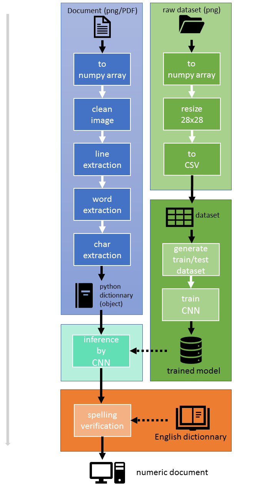

# Character Extraction

## 1) Application description

### Diagram  

### What it does right now
**1)** Character extraction from computer document based on OpenCV and classic OCR

- Extract lines

- then extract words from lines

- then extract characters from words

- store everything in sorted dictionnaries 1 doc dict <== <N line dicts <==M word dicts <== X chars)

  

**2)** Generate CSV dataset from [here](http://www.ee.surrey.ac.uk/CVSSP/demos/chars74k/). (3rd one, named EnglishFnt.tgz)

- *train_datas.csv* contains training samples <u>sorted by characters</u>
- *labels.csv* contains labels of training samples
- *table.csv* contains conversion table from labels to real character

**3)** Train a CNN with computer font images, save the model and use the saved model to recognize characters

- Not very effective for now (90%). Still need improvements (>98%)
- After studying the errors of the model, I found that errors was made due to several issues in the dataset :
  - Lots of fonts have their lowercase letters that actually are the same as the uppercase ones
  - O, o and 0 are the most common mistakes as sometimes they can't be diferenciated
  - The other problem is that all the letters are rescaled to a common size. Then letters like W, w, V, v, U, u, ... can sometimes be misinterpreted
- Then, 90% is not that bad in that case. But I will maybe have to clean the dataset and improve it regarding the 3 points above.

### In the future
**4)** CNN inference integrated in the whole program to recognize every char

**5)** Generate document in txt format

**6)** Replace classical OCR character separation by ML based method

## 2) Instruction
**Run** *"char_extract.py"* for char extraction from a document

**Extract** the archive named *"EnglishFnt.tgz"* in the *./dataset/* directory

**Run** *"manage_dataset.py"* for dataset generation

**Play** with "neural_network.py"

## 3) Problems

Not effective with all writing policies.
To many problems, but I wanted to try.

Regarding bullet (6) :

Way better to go for a ML method in order to extract characters in an image. 
A good method would be for example to move a frame around the image. 
The content of this frame would then feed a NN which would tell if there's a character or not.
If there's a character, the content of the frame would be stored to be analyzed by another NN to determine which character it is.

